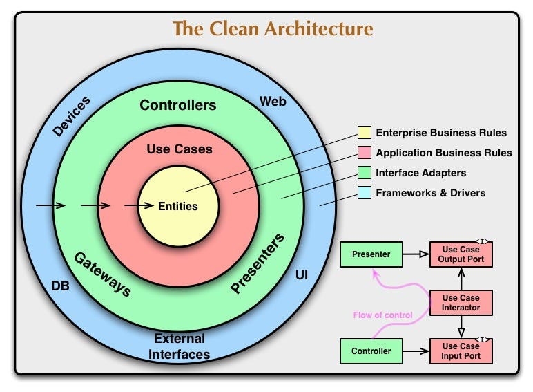

# Clean Architecture

- Arquitetura limpa
- É agnóstico a tecnologia
- Desacoplamento

- Camada azul, é a forma que a nossa aplicação tem de se comunicar com o mundo
  - Infraestrutura - Banco de Dados, a camada que o usuário interage
- Camada verde, Vai adaptar as informações que ta vindo da camada azul para que a camada mais interna vermelha entenda, e proteger as camadas internas de use-cases e entidades da implementação direta da camada de infraestrutura que é a azul.
  - Inversão de dependências.

# DDD

- Design de software é como converter um problema da vida real para um pedaço de software
- 